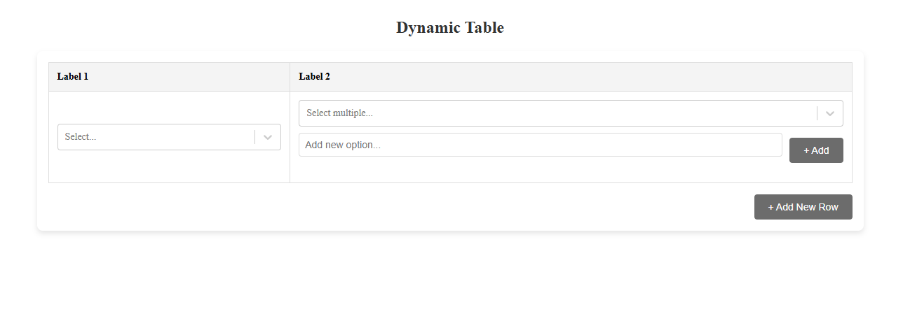

# **Dynamic Table**

## Overview

This is a simple React application that displays a dynamic table with interactive dropdowns, allowing users to select options and add new rows. The table supports:

- **Single Select Dropdown**: Ensures each row has unique selections.
- **Multi-Select Dropdown**: Allows the user to select multiple options and add custom items.
- **Dynamic Row Addition**: Users can add new rows with their own selections.

This application demonstrates the use of **React hooks** for state management and utilizes **CSS** for styling.

## Features

### 1. **Single Select Dropdown (Column 1)**
   - This column features a **single-select dropdown** with options that, once selected, become unavailable for subsequent rows to maintain uniqueness across the table.

### 2. **Multi-Select Dropdown (Column 2)**
   - The second column contains a **multi-select dropdown**, where users can select multiple items. Additionally, users can add custom options directly within the dropdown.

### 3. **Add New Row**
   - A button at the bottom of the table allows users to add new rows. When a new row is added, the dropdowns for both columns are displayed with the same functionality.

## Technologies Used

- **React**: For building the user interface, managing the state, and handling component updates.
- **React Hooks**: Used to manage the state of the table, dropdown selections, and dynamically added rows (`useState`).
- **CSS**: For styling the table, dropdowns, and layout.
---

## **Demo**

🚀 [Deployment Link](https://table-task-bbf0uyjch-paromita-mistris-projects.vercel.app/)
---

## Installation and Setup
- Follow these steps to set up and run the project locally:
## **Installation**

1. **Clone the Repository**:
   ```bash
   git clone https://github.com/Paro0987/Table-Task.git
   cd frontend
2. **Install Dependencies**:
   ```
   npm install
4. **Start the Development Server**:
   ```
   npm run dev

  ---
### Screenshots :camera:

---
- **Dynamic Table**
---


---
